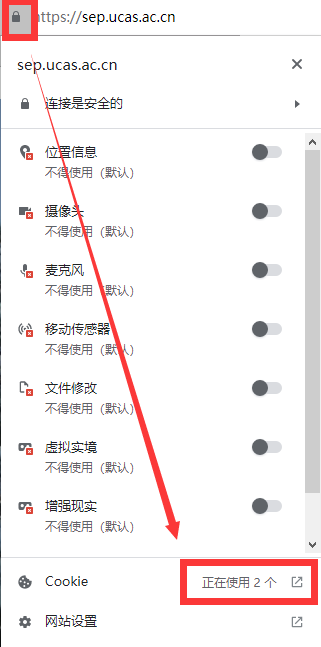
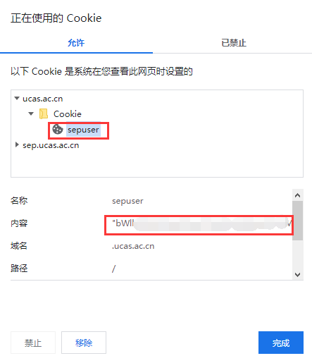

## 简介
众所周知，果壳的教务系统要查成绩，首先要评教。  
但讲个笑话，出成绩了→发现没评教→打算去补→发现评价不了……  
还有一点，评教的主观题强制要求十五字，就很\*\*……  
虽然有个json的简单方法，但它也要你从SEP系统一路点到成绩查询页面，期间要经过好几次重定向，还有讨厌的提醒弹窗。

本人深受其苦，所以有了这个小工具。  
程序需要使用你的SEP账号Cookie来执行查询，但并不收集任何信息。  
从[原理](#原理)上来说，使用不会有风险，但不排除系统检测到短时间、高频请求，然后被记录的可能性。  
另外，我还另外加上了绩点计算，方便大家查看每一门的绩点。

为了大家能放心使用，我把源码发上来了，有兴趣的同学可以自行研究。  
下载地址：[Release](https://github.com/xenon2333/ScoreQueryTool/releases)

## 使用方法
进入SEP系统，登录你的账号后，在浏览器中找到查看Cookie的位置。  
一般是在网址栏的左侧的“锁状”图标，点开后找到Cookie，如图：

找到下图中名为"sepuser"的Cookie**（切记！请不要把这个Cookie分享给任何人！）**，复制它的**完整**内容**（引号也要复制完整！）**。

运行程序，将上面的字符串粘贴到输入框中，点击**“解析！”**按钮开始查询。

如果Cookie和网络都没有问题的话，就能在下面看到你的成绩了。

查询出现问题，请自行排查Cookie是否正确、网络是否畅通。

## 原理
首先要知道，在成绩查询页面的末尾加上".json"访问就能查看成绩数据了。  
为什么还需要这么一个工具呢？  
当然是因为这个json文件，访问也需要带Cookie，没Cookie就会提示身份过期，然后就重定向了。

那怎么获取这个Cookie呢？  
我本来想着，教务网站的用户Cookie值应当是基本不变的，只要复制一次就能一直用。  
没想到啊……

它用的是"SESSION"，这个值是由服务器动态生成的，根本不固定，只要你不带正确的值访问，都会触发重定向……  
那只好退一步了，看看有没有其它的Cookie能用？  
还真有，就是程序要求填的"sepuser"，这个是每个用户登录SEP的唯一凭证。  
**理论上有了这个Cookie，所有需要用SEP跳转的系统里都能成功认证，所以泄露是十分危险的！**

让我们来看看，怎样才能通过"sepuser"得到需要的东西。
1. 首先，先不带Cookie访问SEP，得到一个名为"JSESSIONID"的Cookie。
2. 然后在请求头里带上这两个Cookie（sepuser+JSESSIONID），访问：s\*p.\*\*\*\*.a\*.cn/portal/site/226/821 。
3. 在返回的文档中寻找"Identity"字符串，获取Id值。
4. 将这个Id值作为查询参数，传给 jwxk.\*\*\*\*.a\*.cn/login 页面。
5. 页面返回的响应头部中就包含所要的"SESSION"值。

……我觉着还挺麻烦的……  
接下来要做的，就是把中间这些步骤全部丢给程序干，你要做的就是拿到"sepuser"。  
使用它的好处就是一劳永逸，除非它改逻辑，否则获取一次Cookie就能一直用下去，不用担心失效。

以上的原理，对于SEP的其它页面，应当也是类似的。  
所以理论上也能通过相同的逻辑，访问其它页面（例如课程网站）。

## 反馈
邮箱：xenon2333@qq.com 欢迎反馈问题和意见。