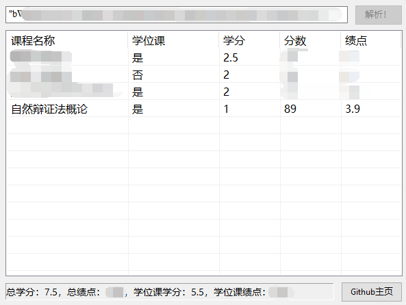

## 简介
众所周知，果壳的教务系统要查成绩，首先要评教。  
但讲个笑话，出成绩了→发现没评教→打算去补→发现评价不了……  
还有一点，评教的主观题强制要求十五字，就很\*\*……

本人深受其苦，所以有了这个小工具。  
程序需要使用你的SEP账号Cookie来执行查询，但并不收集任何信息。  
从原理上来说，使用不会有风险，但不排除系统检测到短时间、高频请求，然后被记录的可能性。

为了大家能放心使用，我把源码发上来了，有兴趣的同学可以自行研究。  
下载地址：[Release](https://github.com/xenon2333/ScoreQueryTool/releases)

## 获取Cookie
进入[SEP系统](https://sep.ucas.ac.cn/),登录你的账号后，在浏览器中找到查看Cookie的位置。  
一般是在网址栏的左侧的“锁状”图标，点开后找到Cookie，如图：

找到下图中名为"sepuser"的Cookie**（切记！请不要把这个Cookie分享给任何人！）**，复制它的**完整**内容**（引号也要复制完整！）**。

运行程序，将上面的字符串粘贴到输入框中，点击**“解析！”**按钮开始查询。

如果Cookie和网络都没有问题的话，就能在下面看到你的成绩了。

查询出现问题，请自行排查Cookie是否正确、网络是否畅通。

## 反馈
邮箱：xenon2333@qq.com 欢迎反馈问题和意见。